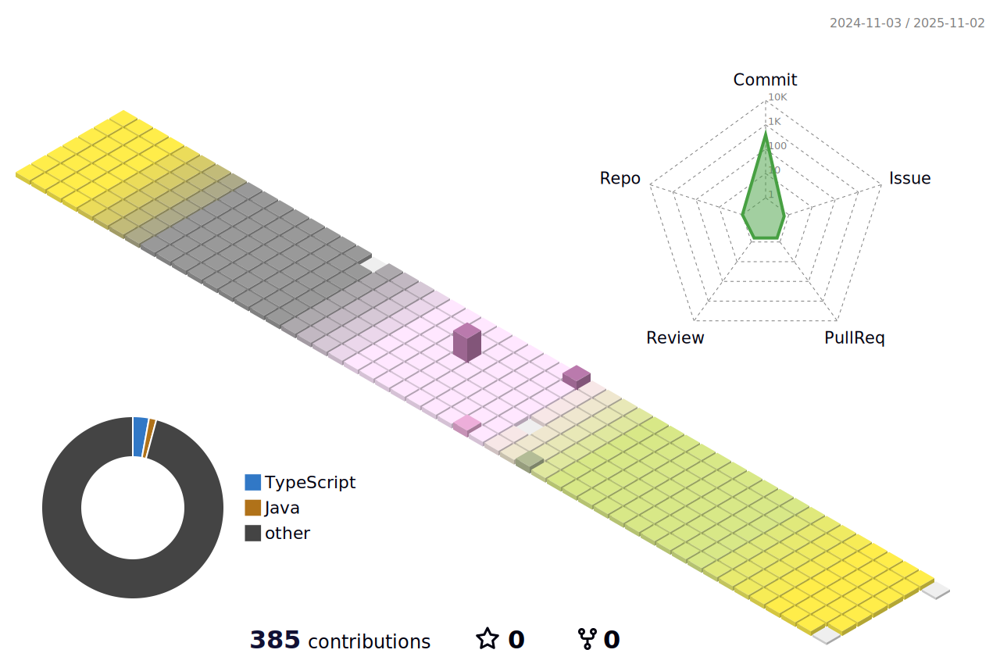

# **My traces and future**
I am a full-stack engineer working in the financial industry for about two years   
My eternal dream is to retire early 🔥

### *Skills*
-------------
     
          
    
 
       
⬇ My swimming pools   
   
   

<!--
**Soocone/Soocone** is a ✨ _special_ ✨ repository because its `README.md` (this file) appears on your GitHub profile.

Here are some ideas to get you started:

- 🔭 I’m currently working on ...
- 🌱 I’m currently learning ...
- 👯 I’m looking to collaborate on ...
- 🤔 I’m looking for help with ...
- 💬 Ask me about ...
- 📫 How to reach me: ...
- 😄 Pronouns: ...
- ⚡ Fun fact: ...
-->
